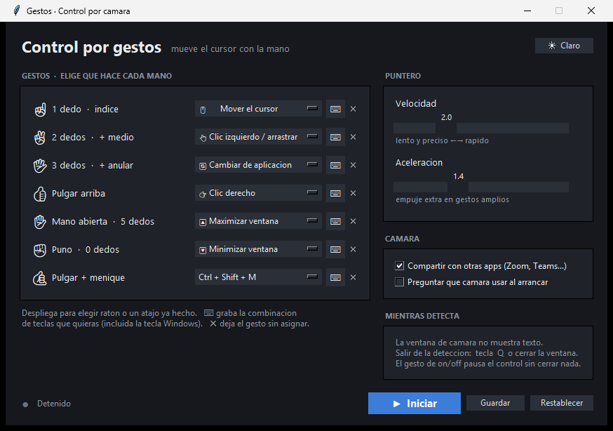

# Control por gestos de mano (MediaPipe + OpenCV)

Controla Windows con la webcam: el dedo índice **mueve el cursor real**
(air-mouse relativo), un gesto **hace clic**, y el resto de gestos lanzan
**atajos de Windows** que tú eliges — maximizar, minimizar, Alt+Tab, volumen,
captura de pantalla… Se maneja todo con una **aplicación con ventana** (no
consola): desde ahí eliges cámara, asignas atajos a cada gesto, cambias el tema
y arrancas.

## La aplicación

Doble clic en **`Gestos.vbs`** (o `iniciar.bat`) y se abre la ventana:



- **Editor de gestos** — cada forma de la mano, con su icono, tiene un
  desplegable para elegir qué hace. Sirve además de chuleta: la ventana de
  detección no muestra texto.
- **Recuadro de atajo** en cada gesto — púlsalo y teclea la combinación, como
  los keybinds de Discord. Funciona con la tecla Windows.
- **Puntero** — velocidad y aceleración con dos deslizadores.
- **Cámara** — compartir con otras apps y si preguntar qué cámara en cada arranque.
- **Tema claro / oscuro** — botón arriba a la derecha.
- **Iniciar / Detener** — arranca la detección en una ventana aparte; púlsalo otra
  vez para pararla. El punto de la esquina se pone verde mientras está en marcha.

Todo se guarda en `config.json` (junto al programa) al pulsar **Guardar** o
**Iniciar**. **Restablecer** vuelve a los valores de fábrica.

## Chuleta de gestos (configuración por defecto)

Los gestos se distinguen por el **número de dedos estirados** — cuentas dedos y
ya está. Este es el mapa por defecto; **todo es editable** en la aplicación.

| Gesto | Qué hace por defecto | Atajo |
|:---:|---|---|
| ☝️ **1 dedo** (índice) | **mueve el cursor** de Windows | — |
| ✌️ **2 dedos** (índice + medio) | **clic izquierdo** — mantén y mueve para **arrastrar** | — |
| 🖖 **3 dedos** | **cambiar de aplicación** | `Alt`+`Tab` |
| 👍 **pulgar arriba** | **clic derecho** | — |
| ✋ **mano abierta** | **maximizar / pantalla completa** | `Win`+`↑` |
| ✊ **puño** | **minimizar ventana** | `Win`+`↓` |
| 🤙 **pulgar + meñique** | mantén **1,2 s**: activa/desactiva el control | — |

En la ventana de detección **no aparece ningún texto**: solo el esqueleto de la
mano y la diana del puntero. **Salir de la detección:** tecla `q`/`ESC` o el
botón X. El pulgar da igual al apuntar y al hacer clic: `1 dedo` y la "L" hacen
lo mismo.

## Archivos

- [launcher.py](launcher.py) — la aplicación con ventana (GUI): editor, tema, arranque
- [gestos_manos.py](gestos_manos.py) — detección, clasificación y bucle principal
- [control_windows.py](control_windows.py) — cursor, clics y atajos (SendInput)
- [camara.py](camara.py) — detección de cámaras, menú de selección y compartir
- [config.py](config.py) — `config.json`: gestos, atajos propios, tema, sensibilidad
- [grabador.py](grabador.py) — captura la combinación de teclas que grabas
- `Gestos.vbs` — abre la GUI sin consola; `iniciar.bat` es la alternativa

## Instalación

Funciona en cualquier PC con Windows y Python 3.9–3.13. Desde la carpeta del
proyecto:

```bash
py -m venv .venv && .venv\Scripts\python.exe -m pip install -r requirements.txt
```

Si no tienes Python, instálalo desde [python.org](https://www.python.org/downloads/).
`iniciar.bat` también funciona sin entorno virtual: si no encuentra `.venv`, usa
el Python del sistema.

## Ejecución

Doble clic en **`Gestos.vbs`** (abre la ventana, sin consola). En la GUI pulsa
**Iniciar**. También `iniciar.bat`, o desde la terminal:

```bash
.venv\Scripts\python.exe launcher.py
```

Para arrancar la detección directamente, sin pasar por la GUI (usa `config.json`
o los valores por defecto):

```bash
.venv\Scripts\python.exe gestos_manos.py
```

Con el control activado (arranca en ON), levanta **un dedo** y mueve la mano: el
**cursor de Windows** se desplaza. Sobre la imagen de la cámara verás la diana y
una estela del dedo. La ventana de detección no muestra texto: si no recuerdas un
gesto, mira la [chuleta](#chuleta-de-gestos-configuración-por-defecto).

## Elegir la cámara

Al arrancar, el programa **detecta las cámaras conectadas**. Si hay más de una,
abre un menú con una **miniatura de cada una** para que pulses la que quieras:

- Marca **"Recordar mi elección"** y no volverá a preguntar (se guarda en
  `config_camara.json`, junto al programa). Bórralo para que vuelva a preguntar.
- Con una sola cámara no molesta: la usa directamente.
- Para forzar una fija `INDICE_CAMARA = 0` (o el número que sea) en el código, y
  se salta el menú. Para que el menú salga **siempre**, `MENU_CAMARA_SIEMPRE = True`.
- Los **nombres reales** ("Logitech C920"…) aparecen si instalas `pygrabber`
  (`pip install pygrabber`); si no, se ven como "Camara 0", "Camara 1"…

En portátiles esto resuelve un lío habitual: la cámara de infrarrojos de Windows
Hello suele ocupar el índice 0, así que la webcam normal no es la primera.

**Detección rápida.** El sondeo de cámaras usa **DirectShow**, que abre en
milisegundos y falla al instante en índices vacíos; MSMF podía tardar 1-2 s *por
índice*, así que buscar en 4 posiciones se hacía eterno. Además el sondeo no fija
la resolución (renegociarla es lo lento) y lee un solo frame, que se reaprovecha
como miniatura. Solo la cámara que **eliges** se abre luego con MSMF, para poder
compartirla. Si con DirectShow no aparece ninguna, se reintenta con MSMF.

## Compartir la cámara con otras apps

Por defecto la cámara se abre en modo **compartido**: puedes tenerla en uso a la
vez en Zoom, Teams, OBS, etc. Esto se apoya en el **Frame Server de Windows**, al
que se accede con el backend Media Foundation (`CAP_MSMF`) en lugar de DirectShow.

Límites honestos:

- Funciona cuando el driver de la cámara soporta el Frame Server — lo normal en
  webcams UVC modernas y en Windows 10 (1809+) / 11.
- Si **otra app la tiene en exclusiva** (algunas apps antiguas de DirectShow),
  no habrá forma de compartir: es una limitación del sistema, no del programa.
- El menú indica con qué backend se abrió cada cámara: *compartida (MSMF)* o
  *exclusiva (DirectShow)*.

Para volver al modo exclusivo (abre algo más rápido) pon `COMPARTIR_CAMARA = False`.

Teclas de respaldo (solo funcionan si la ventana de la cámara tiene el foco):
`q`/`ESC` salir, `c` activar o desactivar el control.

El modelo `hand_landmarker.task` (~7 MB) ya está descargado en la carpeta; si se
borra, el script lo vuelve a bajar solo en el siguiente arranque.

## Repartir a otros equipos

La forma recomendada **no es un ejecutable**, sino el **launcher**: copia la
carpeta del proyecto y ejecuta `Gestos.vbs`. Solo necesita Python instalado (con
`iniciar.bat` se crea el entorno). Es lo que pediste: un lanzador ligero, no un
programa de 265 MB que hay que instalar.

Ventajas frente al `.exe`:

- **Ligero** — unos pocos KB de código, no cientos de MB empaquetados.
- **Sin bloqueos** — Windows (Smart App Control / SmartScreen) bloquea los `.exe`
  sin firmar. Un script de Python que ejecuta tu propio Python no se bloquea.
- **Sin consola** — `Gestos.vbs` abre la GUI directamente, sin ventana negra.

Sigue existiendo `construir_exe.bat` (empaqueta la detección con PyInstaller)
como opción heredada, pero **no es la vía recomendada**: genera un ejecutable sin
firmar que Windows 11 con Smart App Control activo bloquea al ejecutarse.

## El puntero: air-mouse relativo (mueve el cursor real)

Con el gesto de **apuntar** (solo el índice), el **cursor real de Windows** se
mueve según *cuánto* desplaces la mano, no según dónde la pongas — igual que un
ratón o un trackpad. Funciona en cualquier programa.

Si bajas la mano y vuelves a apuntar, el cursor **continúa donde estaba**: al
retomar el gesto el programa se re-ancla a la posición real del cursor, así que
es el efecto de "levantar el ratón para recolocarlo" (embrague). No hay ningún
recuadro que mapear: mueves, sueltas, recolocas, sigues.

Lleva una **aceleración** como la del ratón de Windows: los movimientos lentos
avanzan poco (control fino) y los rápidos avanzan mucho (llegas de un lado a otro
de la pantalla sin recorrer todo el encuadre). Se ajusta con `GANANCIA_PUNTERO`
(velocidad base) y `ACELERACION` (empuje extra en gestos rápidos).

### Calibración portable

La sensibilidad **no está en píxeles**, sino en unidades relativas: el
desplazamiento del dedo se mide como fracción del encuadre y se convierte a
fracción de la pantalla. Por eso `GANANCIA_PUNTERO = 2.0` significa *"cruzar el
encuadre entero equivale a cruzar 2 pantallas"* — y eso vale igual en un
portátil de 1366×768 que en un monitor 4K, y con una webcam de 640×480 o de
1080p.

### Precisión: fino cerca, rápido lejos

El cursor tiene **precisión Y alcance** a la vez, con una curva de ganancia como
la aceleración del ratón de Windows:

- **Movimiento lento** → el cursor avanza poco (ganancia efectiva ~1,0): puedes
  apuntar a cosas pequeñas sin pasarte.
- **Movimiento rápido** → avanza mucho (ganancia efectiva ~4,8): cruzas la
  pantalla de un manotazo.

Además, la punta del dedo pasa por un **filtro One-Euro**, el estándar para
punteros interactivos porque resuelve el dilema *temblor vs. retraso*: adapta su
frecuencia de corte a la velocidad. Con la mano quieta filtra fuerte y se come el
ruido del landmark; en movimiento apenas filtra y sigue al dedo sin arrastre. Un
suavizado fijo no puede hacer las dos cosas: o tiembla, o va con retraso.

Trabaja con **tiempo real** (`dt`), así que el tacto no cambia si bajan los FPS,
y en **coordenadas normalizadas**, para que una webcam de 640 y otra de 1920
filtren igual.

Sus tres parámetros se eligieron por **barrido empírico**, no a ojo: se probaron
60 combinaciones contra ruido realista a 30 fps y el ganador se validó con 5
semillas distintas. Frente al suavizado fijo anterior:

| Métrica (pantalla 1080p) | Antes | Ahora |
|---|---:|---:|
| Vibración con la mano quieta | 0,63 px/frame | **0,02 px/frame** |
| Deriva máxima en reposo | 4,0 px | **1,0 px** |
| Retraso al parar la mano | 31 frames (~1 s) | **8 frames** |
| Error en trazo lento | 1,5 px | **1,0 px** |

**El movimiento lento se acumula, no se pierde.** Un gesto lento reparte muy
pocos píxeles por frame, y cada uno cae por debajo de la zona muerta. Si se
descartaran, el cursor **no se movería en absoluto** por mucho que arrastraras el
dedo — justo al apuntar con cuidado. Por eso el desplazamiento se guarda en un
residuo que se acumula hasta dar un paso. El ruido aleatorio se cancela solo al
sumarse, así que esto no reintroduce temblor.

Ajusta la sensibilidad general con el **deslizador "Velocidad"** de la GUI
(`GANANCIA_PUNTERO`): súbelo si el cursor se queda corto, bájalo si se escapa.
"Aceleración" controla cuánto empuje extra dan los gestos rápidos.

### Detalles

- **Una sola mano** (`MAX_MANOS = 1`): así el puntero no salta a otra mano que
  aparezca en el encuadre. Antes, con dos manos, MediaPipe cambiaba el orden
  entre frames y el cursor se iba a la mano equivocada.
- **Rechazo de saltos**: si la punta "teletransporta" más de `SALTO_MAX` (35 %
  del encuadre) en un frame —un glitch, o que la detección cambie de mano— el
  puntero se reancla ahí y **no mueve el cursor**, evitando el latigazo.
- **Portable**: la sensibilidad va en fracciones del encuadre, no en píxeles, así
  que el tacto es idéntico en cualquier webcam y monitor (un test barre el dedo
  en 4 pantallas y 4 webcams y el recorrido relativo coincide, dispersión
  < 0,05 %). Lo mismo para `ZONA_MUERTA` y `UMBRAL_ARRASTRE`.
- El movimiento se inyecta con `SendInput` en coordenadas absolutas del
  escritorio virtual: va bien con varios monitores y con escalado (*DPI-aware*).
- **Si Windows rechaza la entrada sintética** (una ventana abierta *como
  administrador* en primer plano, una política de seguridad o un antivirus
  pueden bloquearla), la app **avisa una vez y sigue funcionando** en lugar de
  cerrarse. Si el cursor no se mueve pero la mano sí se detecta, mira la consola:
  ahí aparece el aviso. Suele arreglarse cerrando o desenfocando la ventana
  elevada.

## Los clics

- **Clic izquierdo** → estira **2 dedos** (índice + medio). Un toque corto es un
  clic; si los **mantienes arriba y mueves la mano, arrastras** (arrastrar y
  soltar, seleccionar texto, mover ventanas).
- **Clic derecho** → **pulgar arriba** 👍. Tiene que apuntar hacia arriba de
  verdad: un puño con el pulgar asomando de lado no cuenta.

Antes el clic derecho eran 3 dedos, pero exigía estirar el **anular** dejando el
meñique abajo — un movimiento que a casi nadie le sale limpio, y el meñique
tiende a subirse solo. El pulgar es independiente por naturaleza, así que sale
sin pensar.

Dos detalles para que no falle:

**El clic no arrastra el cursor sin querer.** Al pulsar, el cursor se **congela**
en el sitio, así que el clic cae justo donde apuntabas. Solo cuando mueves la
mano más de `UMBRAL_ARRASTRE` (2 % del encuadre) pasa a arrastrar de verdad.

**No hay clics accidentales al abrir o cerrar la mano.** Al pasar de puño a mano
abierta los dedos cruzan un instante por "2" y por "solo pulgar". Contra eso hay
dos defensas: el voto mayoritario de 5 frames (un estado que dura 2 frames no
llega a registrarse) y, para el clic derecho, `ESTABILIDAD_CLIC_DER` (0,15 s) de
gesto mantenido.

**Seguridad:** el botón nunca se queda hundido. Se suelta al perder la mano, al
apagar el control, al cambiar de gesto y al salir del programa (`soltar_todo`).

## Asignar atajos (como los keybinds de Discord)

Cada gesto tiene a la derecha un **recuadro con su combinación de teclas**.
Púlsalo, teclea lo que quieras — **incluida la tecla Windows** — y queda
asignado al instante. Sin diálogos ni pasos intermedios. La ✕ deja el gesto sin
asignar, y `Esc` cancela la grabación.

Se guardan en `config.json`; el identificador se deriva de las propias teclas,
así que grabar dos veces la misma combinación no crea duplicados.

**Por qué funciona con la tecla Windows.** Windows se queda para sí las
combinaciones con `Win` (`Win`+`↑`, `Win`+`D`, `Win`+`L`…) y **nunca llegan a la
aplicación**: con un `bind` normal de tkinter, intentar grabar `Win`+`↑` te
maximizaría la propia ventana de grabación. Por eso se usa un hook
`WH_KEYBOARD_LL`, que ve las teclas antes que el sistema y se las traga mientras
grabas.

Está verificado de verdad: el test inyecta `Win`+`F9`, `Ctrl`+`F9` y
`Ctrl`+`Shift`+`F9` reales y comprueba que el hook los captura.

**El hook no toca la interfaz.** Se ejecuta *dentro* del despacho de mensajes de
Windows, y Tcl/tkinter no es reentrante: llamar a la GUI desde ahí —o
desinstalar el propio hook desde dentro de sí mismo— tumbaba el proceso con un
fallo que Python ni siquiera puede capturar. Por eso el hook **solo deja el
resultado en un atributo**, y la ventana lo recoge cada 30 ms desde su propio
bucle. Ahí sí es seguro guardar, repintar y desinstalar.

> **Dos bugs que costó encontrar:**
> 1. Al instalar el hook se pasaba el handle del módulo y, sin declarar las
>    firmas de ctypes, se truncaba de 64 a 32 bits. Fallaba con el error 126 y
>    parecía que el sistema lo prohibía. Con `hMod = None` funciona.
> 2. El hook llamaba directamente a tkinter y se desinstalaba a sí mismo desde
>    dentro del callback: **la app se cerraba al asignar cualquier atajo**. La
>    prueba `test_asignar` encadena cuatro asignaciones con el `mainloop` real
>    —incluyendo una letra suelta y `Win`+`↑`— para que no vuelva a colarse.

## Catálogo de atajos incluidos

Además de los tuyos, cada gesto puede lanzar cualquiera de los **32 atajos
predefinidos**, agrupados por categoría:

| Categoría | Ejemplos |
|---|---|
| **Ventanas** | maximizar `Win`+`↑`, minimizar `Win`+`↓`, acoplar a izquierda/derecha, cerrar `Alt`+`F4`, pantalla completa `F11` |
| **Cambiar de app** | Alt+Tab, vista de tareas, mostrar escritorio, escritorio virtual anterior/siguiente |
| **Sistema** | Explorador, Configuración, buscar, bloquear, recorte de pantalla, panel de emoji |
| **Edición** | copiar, pegar, deshacer, rehacer, seleccionar todo, guardar |
| **Multimedia** | subir/bajar volumen, silenciar, reproducir/pausar, pista siguiente/anterior |
| **Navegador** | pestaña nueva, cerrar pestaña, recargar |

**Se disparan una sola vez.** Hay que mantener el gesto 0,35 s y luego **soltarlo
para volver a lanzarlo**. Esto es deliberado: un atajo repitiéndose cada pocas
décimas sería desastroso — imagina "cerrar ventana" en bucle.

Añadir uno al catálogo predefinido es **una línea** en el diccionario `ATAJOS`
de [config.py](config.py): id, etiqueta con emoji y las teclas. Ni la detección
ni la GUI necesitan cambios. (Para uso normal no hace falta: grábalo desde la
aplicación.)

Detalle de implementación: los modificadores (`Win`, `Alt`, `Ctrl`, `Shift`) se
sueltan siempre en un `finally`, y al salir del programa se sueltan todos. Dejar
`Win` o `Alt` hundidos dejaría el equipo inservible.

> Antes esto era la **Lupa de Windows** (zoom de toda la pantalla). Se quitó: lo
> útil no era agrandar, sino maximizar la ventana y cambiar de aplicación.

## Ajustes de rendimiento

Todo está agrupado en el bloque *Configuración* al inicio de
[gestos_manos.py](gestos_manos.py):

- `ESCALA_DETECCION` (0.6) — la inferencia corre sobre una copia reducida del
  frame; bajarlo a 0.5 va más fluido, subirlo a 1.0 mejora manos lejanas.
- `MAX_MANOS` — ponlo a `1` si solo necesitas una mano: es la mejora de
  fluidez más directa.
- `ANCHO`/`ALTO` — 960×540 es un buen equilibrio; 1280×720 se ve mejor pero
  cuesta en dibujado.
- `GANANCIA_PUNTERO` — sensibilidad del cursor; usa la
  [tabla de arriba](#ajustar-la-sensibilidad). `ACELERACION` — empuje extra en
  los gestos rápidos, para cruzar la pantalla de un manotazo.
- `INDICE_CAMARA` — `None` detecta y abre el menú; un número fuerza una cámara.
  `MENU_CAMARA_SIEMPRE`, `COMPARTIR_CAMARA` — ver
  [Elegir la cámara](#elegir-la-cámara) y [Compartir la cámara](#compartir-la-cámara-con-otras-apps).
- `UMBRAL_ARRASTRE` — cuánto hay que mover la mano para pasar de clic a
  arrastre. `ESTABILIDAD_CLIC_DER` — cuánto hay que mantener 👍.
- `VENTANA_SUAVIZADO` — frames del voto mayoritario; subirlo da gestos más
  estables (menos clics accidentales) a costa de algo de retraso.
- `ESPERA_ATAJO` — cuánto hay que mantener un gesto para lanzar su atajo.
- `ESPERA_CONTROL` — cuánto hay que mantener 🤙 para activar/desactivar.
- `SIMULAR_ENTRADA = True` — modo seguro: imprime las acciones en vez de
  enviarlas al sistema.

Otras optimizaciones ya aplicadas: backend DirectShow (arranque rápido en
Windows), `CAP_PROP_BUFFERSIZE=1` para no acumular latencia, modo `VIDEO` del
HandLandmarker (reusa el *tracking* entre frames en vez de redetectar) y
esqueleto dibujado con primitivas de OpenCV. Al quitar todo el texto en pantalla
también se ahorra el dibujado del panel y sus mezclas de transparencia.

## Cómo se clasifica

`dedos_extendidos()` decide dedo a dedo con criterios **angulares** (ángulo de la
articulación PIP, y de la IP para el pulgar) más una comprobación de distancia
respecto a la muñeca. Al no depender de coordenadas absolutas, funciona con la
mano girada o inclinada y a cualquier distancia de la cámara.

`clasificar_gesto()` es luego una simple consulta a la tabla `PATRONES`, que
traduce la tupla `(pulgar, índice, medio, anular, meñique)` a una **forma** de la
mano (id estable: `un_dedo`, `dos_dedos`, `pulgar`…). No hay ni un umbral de
distancia entre puntas; el único caso especial es 👍, que además exige que el
pulgar apunte hacia arriba de verdad.

La detección separa **forma** (lo que ve la cámara) de **acción** (lo que hace la
app). El bucle mira `config.json` para saber qué acción tiene asignada cada forma
— por eso el editor de la GUI puede recablear los gestos sin tocar el código. La
config se sanea al cargarla: un archivo viejo, incompleto o manipulado nunca deja
la detección con valores imposibles.

`SuavizadorGesto` aplica un voto mayoritario sobre los últimos 5 frames para que
el gesto no parpadee (y para que los estados intermedios al abrir o cerrar la
mano no cuenten), y `AccionSostenida` exige mantener el gesto y soltarlo antes
de repetir, para que un gesto largo no encadene disparos.

## Qué se ha verificado

Con pruebas automáticas, sin cámara:

- Construcción del `HandLandmarker` y `detect_for_video` con el modelo real
  (vía `--selftest`).
- Los patrones de dedos con landmarks sintéticos: cada número de dedos da la
  **forma** correcta, no hay patrones duplicados, y con el mapa por defecto cada
  forma cae en la acción esperada (y ninguna de ratón se confunde con un atajo).
- **Config y GUI**: `config.json` se guarda y recarga sin perder nada; una config
  corrupta, incompleta o con valores inválidos se repara a los defaults; y el
  editor de la GUI hace round-trip (lo que pones en los desplegables, los
  deslizadores y el tema es exactamente lo que se guarda).
- Que **no queda ninguna indicación en pantalla**: ni una llamada a
  `cv2.putText`, ni contador de FPS, y las funciones de panel, etiqueta y barra
  de progreso están eliminadas (el dibujo del esqueleto y la diana se mantienen).
- Air-mouse relativo: arranca anclado al cursor real, la mano lo empuja en la
  dirección correcta, el embrague no salta al recolocar, la zona muerta ignora el
  temblor y nunca se sale del escritorio virtual (incluido un segundo monitor con
  coordenadas negativas).
- **Precisión y robustez del puntero**: la ganancia efectiva es baja en
  movimientos finos y alta en rápidos, el avance por frame crece con la
  velocidad, un dedo con ruido en reposo apenas mueve el cursor, y un **salto
  imposible entre frames** (la otra mano) se reancla sin mover el cursor
  mientras que un gesto rápido plausible sí mueve. Hay además un banco de
  pruebas que mide temblor, retraso y error de trazo con ruido sintético.
- **Regresión del movimiento lento**: arrastrar el dedo muy despacio (0,3 px por
  frame) mueve el cursor y da un recorrido comparable al de un gesto normal.
  Antes daba **0 px**: el gesto se perdía entero bajo la zona muerta.
- **Atajos**: se disparan al mantener el gesto, **no se repiten** mientras lo
  sostienes, se rearman al soltarlo, un gesto fugaz no lanza nada, y una tecla
  desconocida se rechaza en vez de fallar. Todo el catálogo se valida contra el
  mapa de teclas —así se detectó que `Win`+`.` (panel de emoji) usaba una tecla
  que faltaba— y cada atajo lleva su emoji.
- **Grabador, captura REAL**: se inyectan `Win`+`F9`, `Ctrl`+`F9` y
  `Ctrl`+`Shift`+`F9` de verdad y el hook los captura — incluidas las
  combinaciones con la tecla Windows, que el sistema normalmente intercepta.
- **Grabador, lógica**: capta Ctrl+S, Win+↑, Alt+Tab y Ctrl+Shift+M; normaliza el orden
  de los modificadores (Ctrl+Shift+K == Shift+Ctrl+K); soltar un modificador
  antes de la tecla lo excluye; Esc solo cancela pero Ctrl+Esc sí se graba; una
  tecla que la app no sabe reenviar se ignora; y **todo lo grabado se puede
  volver a enviar**.
- **Atajos propios**: sobreviven a guardar/cargar, se asignan a un gesto, se
  resuelven sus teclas, aparecen en su grupo del menú, y un archivo con basura
  (teclas inventadas, sin nombre, lista vacía) se descarta entero.
- Que ningún gesto exige estirar el **anular** ni aislar el **meñique**, y que un
  pulgar asomando **de lado** no dispara el clic derecho.
- **Portabilidad**: el mismo gesto recorre el mismo % de pantalla en 1366×768,
  1080p, QHD y 4K, y con webcams de 640×480 a 1080p (dispersión < 0,05 %); el
  cursor no se sale por el borde de un monitor en coordenadas negativas; y
  ningún archivo distribuible contiene rutas absolutas.
- **Cámara**: `compartir` prueba MSMF antes que DirectShow para el capture real;
  la miniatura se codifica a PNG válido; el menú se salta con una sola cámara, se
  respeta una preferencia guardada, `MENU_CAMARA_SIEMPRE` la fuerza,
  `INDICE_CAMARA` manda sobre todo, y un `config_camara.json` corrupto se ignora.
- **Detección rápida**: el sondeo usa DirectShow (no MSMF), no fija resolución,
  hace una sola lectura por cámara, etiqueta con el backend de uso real, y
  reintenta con MSMF solo si DirectShow no ve ninguna.
- **Clics**: 2 dedos pulsan y sueltan el botón; un temblor pequeño sigue siendo
  clic y un movimiento claro pasa a arrastre; el cursor se congela durante el
  clic; el clic derecho pulsa y suelta sin quedarse abajo y no se dispara al
  cerrar la mano.
- **Seguridad del botón**: `soltar_todo()` libera ambos botones, y cambiar de
  gesto (p. ej. de 2 dedos a mano abierta) lo suelta — nunca queda hundido.
- `AccionSostenida`: progreso, disparo único y rearme tras soltar.
- **Movimiento real del cursor**: `mover_cursor` coloca el cursor de Windows en
  el punto pedido (llamada real a `SendInput`, verificada con `GetCursorPos` y
  devolviendo luego el cursor a su sitio).
- El dispatch del bucle, ahora por **acción**: `mover` desplaza el cursor,
  `clic_izq` pulsa, los atajos se lanzan, y con el control apagado no
  se mueve nada.
- `sizeof(INPUT)` correcto en 64 bits.

Sin cámara, **233 comprobaciones en verde** (71 gestos/clics/atajos + 35
config/GUI/atajos propios + 32
puntero/cursor + 25 cámara/menú/arranque + 21 config/GUI + 12 portabilidad
+ 12 precisión + 9 dispatch + 8 formas), más renders del launcher (temas claro y
oscuro) y del menú de cámaras. Sin probar: la webcam en vivo, el efecto real de los atajos y los
clics, y que **tu** cámara concreta acepte el modo compartido (depende del
driver). Eso hay que ejecutarlo delante de la
cámara.
