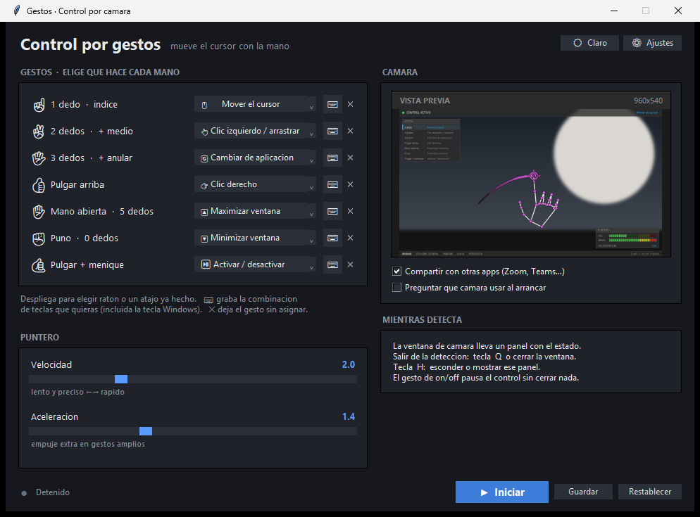
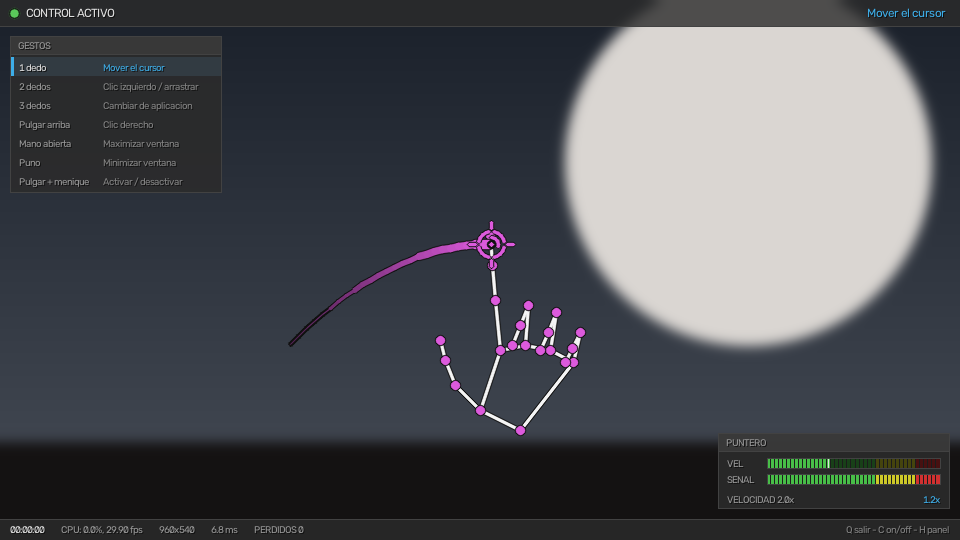
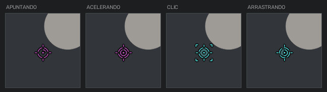
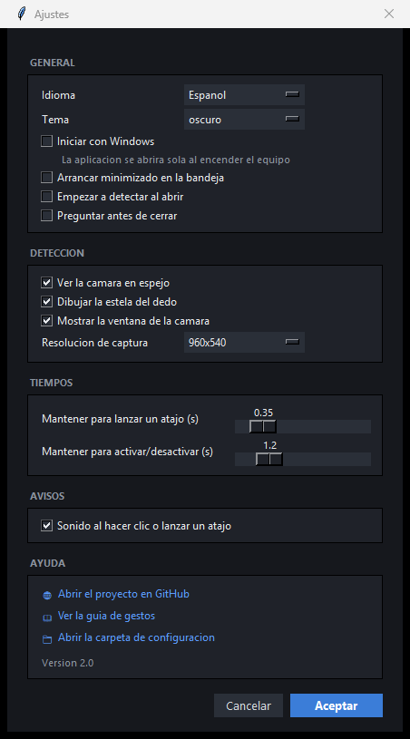
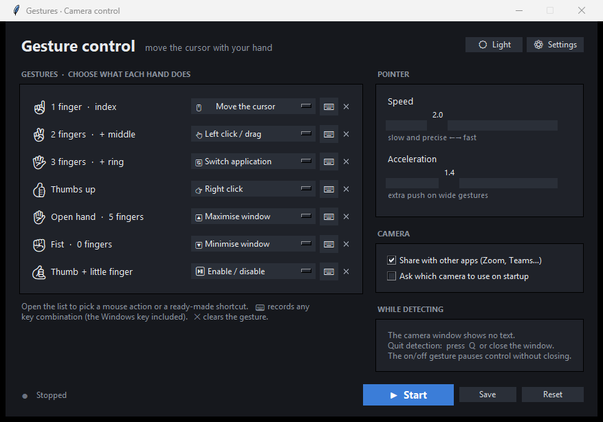

<div align="center">

# Control por gestos

**Mueve el cursor de Windows con la mano, delante de la webcam.**
Sin mando, sin guantes, sin tocar nada.

</div>



Mueve el **cursor real** de Windows, así que funciona en cualquier programa. El
dedo índice apunta, dos dedos hacen clic, y cada forma de la mano puede lanzar el
atajo de teclado que tú elijas.

---

## Los gestos

| Mano | Hace |
|---|---|
| ☝ **1 dedo** (índice) | mueve el cursor |
| ✌ **2 dedos** (+ medio) | clic izquierdo · mantén y mueve para **arrastrar** |
| 👍 **pulgar arriba** | clic derecho |
| 🖐 **3 dedos** (+ anular) | cambiar de aplicación (`Alt`+`Tab`) |
| ✋ **mano abierta** | maximizar (`Win`+`↑`) |
| ✊ **puño** | minimizar (`Win`+`↓`) |
| 🤙 **pulgar + meñique** | mantén 1,2 s: **activa o pausa** el control |

Se distinguen por el **número de dedos estirados**, no por medir distancias entre
las puntas: sale más fácil y falla mucho menos. El pulgar da igual al apuntar y
al hacer clic, y **ningún gesto obliga a mover el meñique solo**.

Todo esto es el punto de partida: en la ventana puedes darle a cada forma la
acción que quieras, incluida cualquier combinación de teclas que grabes.

---

## El HUD



La ventana de detección lleva encima un panel que se lee de un vistazo, sin
apartar la vista de lo que estás haciendo:

- **arriba**, si el control está activo y qué está haciendo la mano ahora mismo;
- **a la izquierda**, los gestos y la acción de cada uno, con el que ve la cámara
  resaltado — así no hace falta acordarse de nada;
- **abajo a la derecha**, los medidores del mezclador: velocidad del puntero y
  calidad de la señal de detección;
- **abajo**, fps, CPU, resolución y frames perdidos.

Se esconde con la tecla **`H`**.

### La mira



El punto del centro es el sitio exacto que se está midiendo. El anillo deja ver
lo que señalas por los huecos, el arco interior dice cuánta velocidad está
aplicando la curva de aceleración, y las esquinas aparecen cuando el puntero está
retenido: al hacer clic, para que caiga justo donde apuntabas.

---

## La vista previa

La ventana principal enseña la cámara dentro, como el preview de OBS. Con la
detección **parada** la abre ella, para que puedas encuadrarte antes de empezar;
con la detección **en marcha** enseña lo que ve el detector, ya con el esqueleto,
la mira y el HUD dibujados.

---

## Instalación

**Con el instalador** — ejecuta `InstalarControlPorGestos.exe` (10 MB). Instala
en tu carpeta de usuario, así que **no pide permisos de administrador**, y
reinstalar encima conserva tus ajustes.

**Desde el código** — necesitas Windows y Python 3.9–3.13:

```bash
preparar_entorno.bat
```

Crea el entorno e instala todo. Luego abre **`Gestos.vbs`** (o `iniciar.bat`).

> Windows puede avisar la primera vez porque el `.exe` no está firmado
> digitalmente. *Más información* → *Ejecutar de todas formas*.

---

## Ajustes

El botón **⚙ Ajustes** abre el panel:



| Sección | Qué hay |
|---|---|
| **General** | idioma (español/inglés), tema, iniciar con Windows, arrancar minimizado |
| **Detección** | espejo, estela del dedo, ventana de cámara, vista previa, HUD, resolución |
| **Tiempos** | cuánto mantener un gesto para lanzar su atajo o para activar el control |
| **Avisos** | sonido al hacer clic o lanzar un atajo |

El idioma se aplica **al instante**, sin reiniciar, y se traduce todo — hasta los
nombres de los gestos:



En **Puntero** hay dos deslizadores: *Velocidad* (súbelo si el cursor se queda
corto) y *Aceleración* (cuánto empujan los gestos rápidos).

---

## Si algo va mal

| Síntoma | Qué pasa |
|---|---|
| Tarda mucho en abrir la cámara | la casilla *"Compartir con otras apps"* usa un backend lento de Windows (medido aquí: **19 s** frente a **4 s** sin ella). Desmárcala si no necesitas la webcam en Zoom a la vez. |
| "No se pudo abrir la cámara" | otro programa la tiene (Discord, Teams, Zoom…). Ciérralo y vuelve a intentarlo. |
| El cursor no se mueve, pero la mano sí se detecta | hay una ventana abierta *como administrador* en primer plano; Windows bloquea la entrada simulada. Desenfócala. |
| Error de Python al abrir `Gestos.vbs` | la carpeta viene de otro equipo y su `.venv` apunta a un Python que aquí no existe. Ejecuta `preparar_entorno.bat`. |

---

## Los archivos

| | |
|---|---|
| [launcher.py](launcher.py) | la ventana principal |
| [gestos_manos.py](gestos_manos.py) | detección, clasificación y bucle principal |
| [hud.py](hud.py) · [vista.py](vista.py) · [puente.py](puente.py) | el HUD, la vista previa y el puente de frames entre procesos |
| [control_windows.py](control_windows.py) | cursor, clics y atajos (`SendInput`) |
| [camara.py](camara.py) · [config.py](config.py) · [idiomas.py](idiomas.py) | cámaras, `config.json` y los textos |
| [sistema.py](sistema.py) · [grabador.py](grabador.py) · [instalador.py](instalador.py) | arranque con Windows, grabar atajos e instalador |

---

## Cómo funciona por dentro

El puntero es un **air-mouse relativo** con filtro One-Euro, curva de
aceleración, compensación de distancia a la cámara y unas cuantas decisiones que
tienen su porqué. Todo eso, con las medidas que lo respaldan, está en
**[TECNICO.md](TECNICO.md)**.
